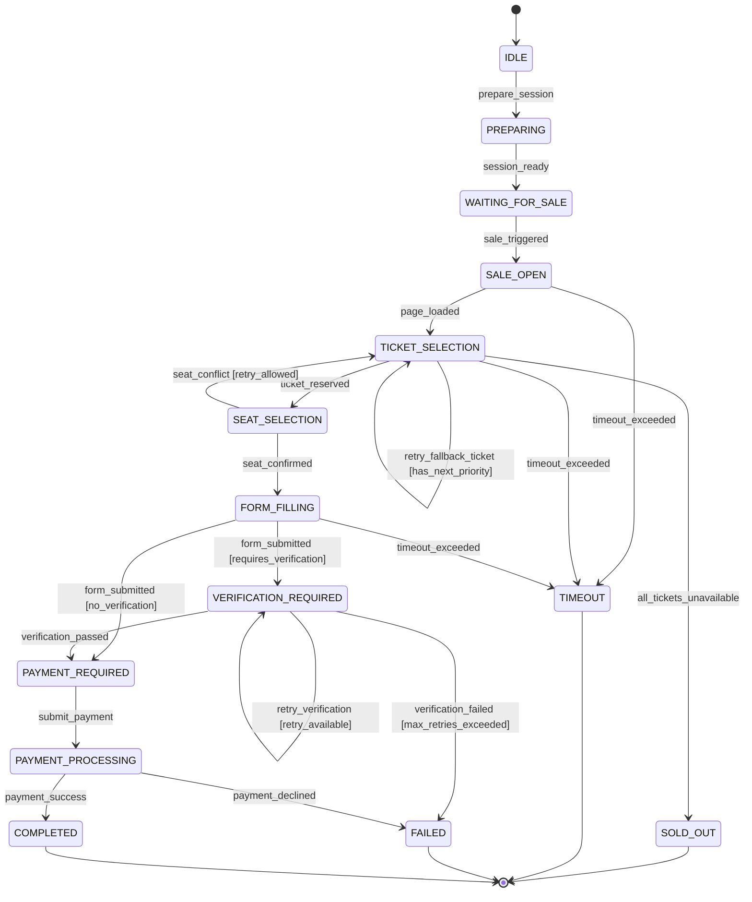

# 自動化票券購買研究系統

## System Design Document（SDD）

**版本：** v0.1.0  
**基準 PRD：** `docs/PRD.md` (v0.1)  
**系統定位：** Ticket Purchase Automation Research System  
**核心技術棧：** Python 3.13+, FastAPI, Playwright, python-statemachine, APScheduler, Redis / Task Broker, SQLAlchemy 2.0 (Async), Web Console (SPA)

---

## 1. 系統架構綜述（Architecture Overview）

### 1.1 系統目標與邊界

本系統為一套以研究、觀測、驗證為導向的自動化票券流程系統。系統透過顯式狀態機（Finite State Machine）驅動瀏覽器自動化，量測各階段（排程誤差、頁面載入、票種決策、座位選擇、表單填寫、驗證與付款）之耗時與成功率。

根據討論確認之核心決策：

1. **執行架構**：採 **API Server 與 Worker 獨立行程解耦** 架構，由 Broker 派送任務，保證高負載與瀏覽器執行時不影響 Web 服務響應與高精度排程。
2. **狀態機**：採用成熟的 **`python-statemachine`** 進行宣告式狀態機建模，支援狀態轉移圖匯出、Guard 守門條件與 Lifecycle Hook。
3. **付款流程**：第一階段支援進入完整自動化流程，包含 **自動填寫付款資訊與提交刷卡**，並提供 `PaymentProvider` 抽象層（可切換為 `AutomatedCreditCardProvider` 或 `MockPaymentProvider`）。
4. **即時通訊**：採用 **WebSocket 雙向通訊協定**，實現毫秒級 Telemetry 事件推播與即時手動控制（Pause, Resume, Emergency Stop, Force Step）。
5. **使用者介面**：本地部署提供現代化 **Web Research Console**，支援任務建立、即時狀態與截圖監控、Timeline 視覺化與實驗指標分析。
6. **資料庫選用（決策 A）**：採用 **純 SQLite（WAL 模式 + aiosqlite）** 作為本地主要資料庫，零外部依賴、零 Docker 配置；搭配 SQLAlchemy 2.0 Async Repository 模式，Worker 寫入採記憶體微批次（Micro-batching flush），徹底杜絕 `database is locked`。
7. **DOM 元素深度調研**：基於 KKTIX AngularJS 單頁應用結構（`#registrationsNewApp`），建立精準的 Selectors Registry，涵蓋活動首頁、購票登記、問答題、配位、聯絡人表單至信用卡付款。
8. **工具鏈與套件管理（uv 全面驅動 + pip 雙向相容）**：專案開發、依賴解析與執行全面採用高效能 **`uv`**（`uv venv`, `uv sync`, `uv run`）；依賴規格定義於標準 PEP 621 `pyproject.toml`，並同步維護標準 `requirements.txt`，確保在未安裝 `uv` 的環境下使用原生 **`pip`**（`pip install -r requirements.txt` 或 `pip install -e .`）亦能 100% 完整運作。

---

### 1.2 系統架構圖（Decoupled Component Diagram）

```text
┌──────────────────────────────────────────────────────────────┐
│                    Web Research Console                      │
│     (Task Creator | Realtime Dashboard | Timeline / Logs)    │
└───────────────────────▲───────────────▲──────────────────────┘
                        │ HTTP / REST   │ WebSocket (Telemetry)
                        ▼               ▼
┌──────────────────────────────────────────────────────────────┐
│                   FastAPI Application Server                 │
│  - REST API (Event, Task, Experiment, Config)                │
│  - WebSocket Hub (ConnectionManager & Channel Broadcasting)  │
│  - Event Resolver Service                                    │
└──────────────┬───────────────────────────────┬───────────────┘
               │ Dispatch / Enqueue            │ Read / Write
               ▼                               ▼
┌──────────────────────────────┐   ┌───────────────────────────┐
│     Message Broker / Queue   │   │     Persistence Layer     │
│   (Redis / Task Queue)       │   │  SQLAlchemy (Async)       │
│  - purchase_tasks            │   │  - SQLite (Local MVP)     │
│  - control_commands          │   │  - PostgreSQL (Target)    │
└──────────────┬───────────────┘   └─────────────▲─────────────┘
               │ Pull Task                       │ Persist Events
               ▼                                 │ & Experiments
┌────────────────────────────────────────────────┼─────────────┐
│                 Ticket Purchase Worker Process               │
│                                                              │
│  ┌────────────────────────────────────────────────────────┐  │
│  │                     Scheduler Service                  │  │
│  │   - APScheduler (AsyncIOScheduler)                     │  │
│  │   - Clock Synchronizer (NTP / Server HTTP Header RTT)  │  │
│  │   - Staged Warm-up Timer (T-10m, T-5m, T-1m, T-10s)    │  │
│  └───────────────────────────┬────────────────────────────┘  │
│                              │ Triggers at T=0               │
│                              ▼                               │
│  ┌────────────────────────────────────────────────────────┐  │
│  │                Purchase Orchestrator                   │  │
│  │  ┌──────────────────────────────────────────────────┐  │  │
│  │  │   Purchase State Machine (python-statemachine)   │  │  │
│  │  │   - State Transitions & Guards                   │  │  │
│  │  │   - Fallback & Retry Engine                      │  │  │
│  │  └────────────────────────┬─────────────────────────┘  │  │
│  │                           │ Controls                   │  │
│  │                           ▼                            │  │
│  │  ┌──────────────────────────────────────────────────┐  │  │
│  │  │             Ticketing Adapter (KKTIX)            │  │  │
│  │  │  - DOM Selectors Registry                        │  │  │
│  │  │  - Strategy Engine (Ticket & Seat)               │  │  │
│  │  │  - Verification Provider (OCR / Manual)          │  │  │
│  │  │  - Payment Provider (Auto Card / Mock)           │  │  │
│  │  └────────────────────────┬─────────────────────────┘  │  │
│  │                           │ Browser Ops                │  │
│  │                           ▼                            │  │
│  │  ┌──────────────────────────────────────────────────┐  │  │
│  │  │        Browser Manager (Playwright Chromium)     │  │  │
│  │  │  - Persistent Context (Cookies / Session Reuse)  │  │  │
│  │  │  - CDP Low-level Inspection & Network Sniffing   │  │  │
│  │  └──────────────────────────────────────────────────┘  │  │
│  └───────────────────────────┬────────────────────────────┘  │
│                              │ Streams Telemetry             │
│                              ▼                               │
│  ┌────────────────────────────────────────────────────────┐  │
│  │           Telemetry & Experiment Recorder              │  │
│  │   - structlog (correlation_id)                         │  │
│  │   - Timeline Recorder (Microsecond accurate)           │  │
│  │   - Metrics Collector                                  │  │
│  └────────────────────────────────────────────────────────┘  │
└──────────────────────────────────────────────────────────────┘
```

---

## 2. 領域模型與資料庫設計（Domain Model & Database Schema）

### 2.1 核心領域模型（Entities & Value Objects）

```python
from datetime import datetime
from enum import Enum
from pydantic import BaseModel, Field


class PlatformEnum(str, Enum):
  KKTIX = "kktix"
  TIXCRAFT = "tixcraft"
  IBON = "ibon"


class TaskStatus(str, Enum):
  CREATED = "CREATED"
  SCHEDULED = "SCHEDULED"
  PREPARING = "PREPARING"
  READY = "READY"
  RUNNING = "RUNNING"
  PAUSED = "PAUSED"
  COMPLETED = "COMPLETED"
  FAILED = "FAILED"
  CANCELLED = "CANCELLED"


class TicketPriority(BaseModel):
  price: int
  ticket_name_pattern: str | None = None
  priority: int = 1


class SeatPreference(BaseModel):
  adjacent: bool = True
  strategy: str = (
      "best_available"  # best_available, same_zone, specific_zone
  )
  preferred_zones: list[str] = Field(default_factory=list)


class TicketPreference(BaseModel):
  quantity: int = 2
  priorities: list[TicketPriority]
  seat_preference: SeatPreference = Field(default_factory=SeatPreference)
  fallback_to_any: bool = False


class PaymentMethod(str, Enum):
  MOCK = "mock"
  CREDIT_CARD = "credit_card"


class CreditCardProfile(BaseModel):
  card_number: str  # 加密儲存或由本地安全設定檔載入
  expiry_month: str  # MM
  expiry_year: str  # YY or YYYY
  cvv: str
  cardholder_name: str


class UserContactProfile(BaseModel):
  name: str
  phone: str
  email: str


class PurchaseTaskSpec(BaseModel):
  task_id: str
  event_title: str
  event_url: str
  sale_start_at: datetime
  ticket_preference: TicketPreference
  contact_profile: UserContactProfile
  payment_method: PaymentMethod = PaymentMethod.CREDIT_CARD
  payment_profile: CreditCardProfile | None = None
  max_retries: int = 3
  timeout_seconds: int = 120
```

---

### 2.2 資料庫實體設計（Database Schema - SQLAlchemy 2.0 Async）

```sql
-- 1. Events Table (解析後的活動資訊快取)
CREATE TABLE events (
    id VARCHAR(64) PRIMARY KEY,
    platform VARCHAR(32) NOT NULL,
    organizer VARCHAR(128) NOT NULL,
    event_slug VARCHAR(128) NOT NULL,
    title VARCHAR(256) NOT NULL,
    canonical_url VARCHAR(512) NOT NULL,
    sale_start_at TIMESTAMP WITH TIME ZONE,
    event_start_at TIMESTAMP WITH TIME ZONE,
    status VARCHAR(32) NOT NULL,
    raw_metadata JSON,
    created_at TIMESTAMP WITH TIME ZONE DEFAULT CURRENT_TIMESTAMP,
    updated_at TIMESTAMP WITH TIME ZONE DEFAULT CURRENT_TIMESTAMP
);

-- 2. Ticket Types Table
CREATE TABLE ticket_types (
    id VARCHAR(64) PRIMARY KEY,
    event_id VARCHAR(64) REFERENCES events(id) ON DELETE CASCADE,
    name VARCHAR(128) NOT NULL,
    price INTEGER NOT NULL,
    status VARCHAR(32) NOT NULL, -- AVAILABLE, SOLD_OUT, COMING_SOON
    inventory_estimate INTEGER,
    raw_id VARCHAR(64)
);

-- 3. Purchase Tasks Table
CREATE TABLE purchase_tasks (
    id VARCHAR(64) PRIMARY KEY,
    event_id VARCHAR(64) REFERENCES events(id),
    status VARCHAR(32) NOT NULL,
    spec JSON NOT NULL, -- 完整 PurchaseTaskSpec
    scheduled_at TIMESTAMP WITH TIME ZONE,
    started_at TIMESTAMP WITH TIME ZONE,
    finished_at TIMESTAMP WITH TIME ZONE,
    error_message TEXT,
    created_at TIMESTAMP WITH TIME ZONE DEFAULT CURRENT_TIMESTAMP
);

-- 4. Experiments Table (實驗回合主檔)
CREATE TABLE experiments (
    id VARCHAR(64) PRIMARY KEY,
    task_id VARCHAR(64) REFERENCES purchase_tasks(id) ON DELETE CASCADE,
    strategy_used VARCHAR(64) NOT NULL,
    clock_sync_mode VARCHAR(32) NOT NULL, -- SYSTEM, NTP, SERVER_OFFSET
    sale_time_error_ms DOUBLE PRECISION,
    total_duration_ms DOUBLE PRECISION,
    final_state VARCHAR(64) NOT NULL,
    success BOOLEAN NOT NULL,
    result_summary JSON,
    created_at TIMESTAMP WITH TIME ZONE DEFAULT CURRENT_TIMESTAMP
);

-- 5. Experiment Timeline Events (微秒級關鍵時序事件)
CREATE TABLE experiment_events (
    id BIGSERIAL PRIMARY KEY,
    experiment_id VARCHAR(64) REFERENCES experiments(id) ON DELETE CASCADE,
    sequence INTEGER NOT NULL,
    timestamp TIMESTAMP WITH TIME ZONE NOT NULL,
    elapsed_ms DOUBLE PRECISION NOT NULL,
    stage VARCHAR(64) NOT NULL,
    state_from VARCHAR(64),
    state_to VARCHAR(64),
    action VARCHAR(64) NOT NULL,
    details JSON,
    screenshot_path VARCHAR(512)
);

-- 6. Experiment Metrics Table (指標聚合統計)
CREATE TABLE experiment_metrics (
    experiment_id VARCHAR(64) PRIMARY KEY REFERENCES experiments(id) ON DELETE CASCADE,
    scheduler_error_ms DOUBLE PRECISION,
    sale_detection_ms DOUBLE PRECISION,
    event_page_load_ms DOUBLE PRECISION,
    ticket_selection_ms DOUBLE PRECISION,
    seat_selection_ms DOUBLE PRECISION,
    form_fill_ms DOUBLE PRECISION,
    verification_ms DOUBLE PRECISION,
    payment_ms DOUBLE PRECISION,
    retry_count INTEGER DEFAULT 0,
    selector_fallback_count INTEGER DEFAULT 0
);
```

---

## 3. 核心子系統詳細設計（Subsystems Detailed Design）

### 3.1 Event Resolver & Discovery 模組

**職責**：將使用者輸入之自然語言活動名稱或關鍵字，搜尋並映射至規範的活動頁面與 Metadata。

```text
User Query ("Atarayo Taipei 2026")
            ↓
   [EventSearchService]
      - KKTIX Public Search API
      - KKTIX Explorer Search / HTTP Scraping
            ↓
   [Candidate Matcher]
      - String Token Normalization (去除符號、全半形轉換)
      - Levenshtein Distance & RapidFuzz Score
            ↓
  Match Score >= Threshold (e.g. 0.85)
     ├── True  ─► Auto Select Event
     └── False ─► Return Candidates to Web Console for User Confirmation
            ↓
   [Metadata Parser]
      - Canonical URL (`https://<org>.kktix.cc/events/<slug>`)
      - Sale Start Datetime (ISO 8601 with Timezone)
      - Ticket Types & Price Tier Matrix
```

---

### 3.2 Scheduler & 高精度時間同步模組

本系統需要精確研究排程時間與真實開賣時間的誤差（RQ1）。

#### 時鐘偏差校正演算法

系統維護一個全域 `TimeReference`：
$$t_{\text{target}} = t_{\text{sale}} - \text{offset}_{\text{clock}}$$

1. **NTP 偏差校準**：
   - 透過 `ntplib` 定期向 `pool.ntp.org` 查詢，計算出 $\Delta t_{\text{NTP}}$。
2. **Server HTTP Header RTT 估算**：
   - 在 T - 5m 與 T - 1m 向目標售票伺服器發送輕量 HTTP `HEAD` 請求：
     $$RTT = t_{\text{recv}} - t_{\text{send}}$$
     $$t_{\text{server\_estimated}} = t_{\text{header\_Date}} + \frac{RTT}{2}$$
     $$\Delta t_{\text{server}} = t_{\text{server\_estimated}} - t_{\text{local}}$$

#### 階段式預熱排程器（Staged Warmup Pipeline）

使用 APScheduler 管理長週期任務，在臨界點切換為高精度等待：

```text
Timeline:
[T - 10 min] PREPARE_BROWSER:
             - 啟動 Playwright Chromium 實例
             - 載入 Persistent Context (包含 Storage State 與歷史 Cookies)

[T - 5 min]  CHECK_SESSION:
             - 訪問 KKTIX 首頁驗證會員登入狀態
             - 若 Session 失效，執行預警或觸發登入輔助

[T - 1 min]  NAVIGATE_PAGE:
             - 前往購票登記頁 `https://<org>.kktix.cc/events/<slug>/registrations/new`
             - 建立 CDP (Chrome DevTools Protocol) 網路封包監聽器
             - 預先快取靜態資源

[T - 10 sec] ENTER_READY:
             - 進入狀態機 READY
             - 透過 WebSocket 推播開始倒數

[T - 500 ms] SPIN_WAIT (Tight Loop):
             - 停止 asyncio.sleep()，以高解析度 time.perf_counter() tight-loop
             - 消除 OS 線程排程喚醒抖動 (Jitter)

[T = 0]      TRIGGER_PURCHASE:
             - 觸發狀態機轉移事件: sale_opened
```

---

### 3.3 Purchase State Machine 引擎（使用 `python-statemachine`）

使用 `python-statemachine` 建立顯式宣告狀態機，嚴格禁止非受控的 `sleep` 與連續單行腳本。

#### 狀態定義與轉移圖（Mermaid FSM）



#### 狀態機類別宣告與 Hook 範例

```python
from statemachine import State, StateMachine


class PurchaseWorkflowFSM(StateMachine):
  # 狀態宣告
  IDLE = State(initial=True)
  PREPARING = State()
  WAITING_FOR_SALE = State()
  SALE_OPEN = State()
  TICKET_SELECTION = State()
  SEAT_SELECTION = State()
  FORM_FILLING = State()
  VERIFICATION_REQUIRED = State()
  PAYMENT_REQUIRED = State()
  PAYMENT_PROCESSING = State()
  COMPLETED = State(final=True)
  SOLD_OUT = State(final=True)
  TIMEOUT = State(final=True)
  FAILED = State(final=True)

  # 狀態轉移事件
  prepare_session = IDLE.to(PREPARING)
  session_ready = PREPARING.to(WAITING_FOR_SALE)
  sale_triggered = WAITING_FOR_SALE.to(SALE_OPEN)
  page_loaded = SALE_OPEN.to(TICKET_SELECTION)

  ticket_reserved = TICKET_SELECTION.to(SEAT_SELECTION)
  retry_fallback_ticket = TICKET_SELECTION.to(TICKET_SELECTION)
  all_tickets_unavailable = TICKET_SELECTION.to(SOLD_OUT)

  seat_confirmed = SEAT_SELECTION.to(FORM_FILLING)
  seat_conflict = SEAT_SELECTION.to(TICKET_SELECTION)

  form_submitted = FORM_FILLING.to(VERIFICATION_REQUIRED) | FORM_FILLING.to(
      PAYMENT_REQUIRED
  )

  verification_passed = VERIFICATION_REQUIRED.to(PAYMENT_REQUIRED)
  retry_verification = VERIFICATION_REQUIRED.to(VERIFICATION_REQUIRED)

  submit_payment = PAYMENT_REQUIRED.to(PAYMENT_PROCESSING)
  payment_success = PAYMENT_PROCESSING.to(COMPLETED)
  payment_declined = PAYMENT_PROCESSING.to(FAILED)

  abort_timeout = (
      SALE_OPEN.to(TIMEOUT)
      | TICKET_SELECTION.to(TIMEOUT)
      | FORM_FILLING.to(TIMEOUT)
  )
  abort_failed = (
      PREPARING.to(FAILED)
      | WAITING_FOR_SALE.to(FAILED)
      | SALE_OPEN.to(FAILED)
      | TICKET_SELECTION.to(FAILED)
      | SEAT_SELECTION.to(FAILED)
      | FORM_FILLING.to(FAILED)
      | VERIFICATION_REQUIRED.to(FAILED)
  )

  def __init__(self, task_spec, orchestrator, *args, **kwargs):
    self.task_spec = task_spec
    self.orchestrator = orchestrator
    super().__init__(*args, **kwargs)

  # 狀態轉移生命週期攔截（Telemetry & Timeline）
  def on_transition(self, event, state):
    self.orchestrator.telemetry.record_transition(
        state_from=self.current_state.id,
        state_to=state.id,
        event=event,
    )
```

---

### 3.4 Ticketing Adapter 架構與 KKTIX 實作

#### 抽象介面定義（Port）

```python
from abc import ABC, abstractmethod
from playwright.async_api import Page


class TicketingAdapter(ABC):

  @abstractmethod
  async def navigate_to_event(self, page: Page, event_url: str) -> bool:
    """進入活動主頁或報名頁面"""
    pass

  @abstractmethod
  async def detect_sale_opened(self, page: Page, timeout_ms: int) -> bool:
    """偵測頁面開賣狀態（輪詢或元素變更監聽）"""
    pass

  @abstractmethod
  async def select_tickets(
      self, page: Page, preference: TicketPreference
  ) -> tuple[bool, str]:
    """依照票種策略選取票種與數量"""
    pass

  @abstractmethod
  async def handle_seat_selection(
      self, page: Page, preference: SeatPreference
  ) -> bool:
    """處理劃位流程（電腦自動配位或指定選位）"""
    pass

  @abstractmethod
  async def fill_contact_form(
      self, page: Page, profile: UserContactProfile
  ) -> bool:
    """填寫聯絡人姓名、電話、Email 等資料並同意條款"""
    pass

  @abstractmethod
  async def handle_verification(self, page: Page) -> bool:
    """偵測並處理驗證問題（文字問答題或圖形驗證碼）"""
    pass

  @abstractmethod
  async def execute_payment(
      self, page: Page, payment_profile: CreditCardProfile
  ) -> bool:
    """自動填寫信用卡卡號、過期日、CVV 並提交送出"""
    pass
```

#### KKTIX 特有流程與 Selector Registry

根據對真實 KKTIX 活動頁、購票登記頁與開源自動化工具的實證研究，KKTIX 註冊流程本質上是一套 **AngularJS 單頁應用（`#registrationsNewApp`）**，而非傳統的靜態 HTML 表單。因此所有 input 欄位輸入與 checkbox 勾選必須確保觸發對應的事件（`input`, `change`, `click`）以同步更新 AngularJS 的 `$scope` 雙向綁定。

```python
class KKTIXSelectors:
  """KKTIX 驗證 Selector 註冊表（依網頁生命週期分類）"""

  # =========================================================================
  # 1. 公開活動主頁 (https://<org>.kktix.cc/events/<slug>)
  # =========================================================================
  EVENT_TITLE = ".header-title h1, h1.event-title"
  EVENT_ORGANIZER = ".organizers a, .organizer-name"
  EVENT_SALE_TIME = ".event-info .timezoneSuffix, .period-time .time"
  EVENT_BUY_LINK = [
      ".order-now-section a.btn-point",
      "a.btn-point:has-text('立即購票')",
      "a.btn-point:has-text('下一步')",
      "#order-now a",
  ]
  EVENT_TICKET_TABLE_ROWS = "div.tickets table tbody tr"

  # =========================================================================
  # 2. 購票登記頁 (https://kktix.com/events/<slug>/registrations/new)
  # =========================================================================
  REGISTRATION_APP = "#registrationsNewApp"

  # 票種單元 (支援 table 與 div 清單兩種模板)
  TICKET_UNIT = [
      ".ticket-list .ticket-unit",
      "tr[id^='ticket_']",
      ".display-table",
  ]
  TICKET_NAME = ".ticket-name, td.name"
  TICKET_PRICE = ".ticket-price, td.price"

  # 加號按鈕 (觸發 AngularJS quantityBtnClick)
  TICKET_PLUS_BTN = [
      "button.btn-default.plus",
      "button[ng-click*='quantityBtnClick(1)']",
      "button:has-text('+')",
  ]
  TICKET_MINUS_BTN = [
      "button.btn-default.minus",
      "button[ng-click*='quantityBtnClick(-1)']",
      "button:has-text('-')",
  ]
  TICKET_QUANTITY_INPUT = "input.ticket-quantity, input[type='number']"

  # 同意條款 Checkbox (必須 dispatch click 事件以驅動 AngularJS Model)
  TERMS_CHECKBOX = [
      "#person_agree_terms",
      "input[name='agree_terms']",
      "label:has-text('我同意') input",
  ]

  # 防機器人問答題 (Custom Quiz / Captcha)
  CAPTCHA_CONTAINER = ".custom-captcha-inner, div[ng-if*='captcha']"
  CAPTCHA_QUESTION_TEXT = ".custom-captcha-inner p, .custom-captcha-inner"
  CAPTCHA_INPUT = [
      "input[name='captcha_answer']",
      "input#captcha_answer",
      "input[placeholder*='答案']",
  ]

  # 配位與下一步按鈕 (AngularJS challenge 動作)
  BTN_BEST_AVAILABLE = [
      "button[ng-click='challenge(1)']",  # 電腦配位（優先）
      "button.btn-primary:has-text('電腦配位')",
  ]
  BTN_PICK_SEAT = [
      "button[ng-click='challenge()']",  # 自行選位
      "button.btn-primary:has-text('選位')",
  ]
  BTN_NEXT_STEP = [
      "div.register-new-next-button-area button:not([disabled])",
      "button.btn.btn-primary.btn-lg.ng-isolate-scope:not([disabled])",
      "button[type='submit']:has-text('下一步')",
      "button:has-text('下一步')",
  ]

  # =========================================================================
  # 3. 劃位與訂單填寫頁 (https://kktix.com/events/<slug>/registrations/<order_id>)
  # =========================================================================
  ORDER_COUNTDOWN_NOTICE = "div[ng-switch-when='countingDown']"
  RESELECT_TICKET_LINK = "a.reselect-ticket"

  # 聯絡人表單 (Contact Fields)
  CONTACT_NAME = [
      "input[name='contact[name]']",
      "input#order_contact_name",
      "input[name*='contact_name']",
  ]
  CONTACT_EMAIL = [
      "input[name='contact[email]']",
      "input#order_contact_email",
      "input[name*='contact_email']",
  ]
  CONTACT_PHONE = [
      "input[name='contact[phone]']",
      "input#order_contact_phone",
      "input[name*='contact_phone']",
  ]

  # 實名制參加人欄位 (Attendee Fields - 支援複數參加者 attendees[0], attendees[1])
  ATTENDEE_NAME_TEMPLATE = "input[name='attendees[{index}][name]']"
  ATTENDEE_PHONE_TEMPLATE = "input[name='attendees[{index}][phone]']"
  ATTENDEE_ID_TEMPLATE = [
      "input[name='attendees[{index}][id_number]']",
      "input[name*='field_idnumber']",
  ]

  # 送出訂單按鈕
  BTN_CONFIRM_ORDER = [
      "[ng-click='confirmOrder()']",
      "button[type='submit']:has-text('確認表單')",
      "button:has-text('確認表單資料')",
  ]

  # =========================================================================
  # 4. 信用卡付款頁面 (Credit Card Payment)
  # =========================================================================
  PAYMENT_RADIO_CREDIT_CARD = [
      "input[type='radio'][value*='credit_card']",
      "label:has-text('信用卡') input",
  ]
  CARD_NUMBER_INPUT = [
      "input#card-number",
      "input[name*='card_number']",
      "input[name='pan']",
  ]
  CARD_EXPIRY_INPUT = [
      "input#card-expiry",
      "input[name*='card_expiry']",
      "input[name='expiration']",
  ]
  CARD_CVV_INPUT = [
      "input#card-ccv",
      "input#card-cvv",
      "input[name*='card_cvv']",
      "input[name='cvc']",
  ]
  BTN_CONFIRM_PAYMENT = [
      "button#submit-payment",
      "button:has-text('確認付款')",
      "button:has-text('立即付款')",
  ]

  # =========================================================================
  # 5. 防機器人與驗證偵測 (Anti-Bot / Cloudflare Challenge)
  # =========================================================================
  CLOUDFLARE_CHALLENGE_TEXTS = [
      "正在執行安全驗證",
      "just a moment",
      "請啟用 javascript 與 cookie 以繼續",
      "驗證您是人類",
  ]
```

---

### 3.5 Browser Automation & Session Manager (Playwright)

針對 KKTIX 的防機器人安全防護（Cloudflare Turnstile）與 AngularJS 架構特性，Playwright 管理器採用以下關鍵設計：

1. **Persistent Browser Context（常駐會話與 Clearance 快取）**：
   - 使用 Playwright 的 `launch_persistent_context(user_data_dir=...)`，將登入態與瀏覽器暫存保存於本地 `.browser_profiles/<profile_name>` 目錄。
   - **過關憑證保持**：KKTIX 購票登記頁所要求的 Cloudflare 安全驗證（Turnstile / `cf_clearance`），只要在排程的預熱階段（T - 10m / T - 5m）或平時以有頭模式（Headed）完成一次驗證，Cookies 與 Session 便會持久化保留，確保在 T=0 開賣瞬間無需重複驗證，直通購票登記頁面。
2. **防機器人特徵調校（Research Stealth Configuration）**：
   - 啟動參數禁用自動化標誌：`--disable-blink-features=AutomationControlled`、`--no-sandbox`。
   - 透過 `context.add_init_script()` 注入抹除腳本：

     ```javascript
     Object.defineProperty(navigator, 'webdriver', { get: () => undefined });
     ```

   - 統一設置標準 macOS / Windows User-Agent 與常見視窗解析度（1920x1080）。
3. **AngularJS 事件相容機制**：
   - KKTIX 頁面依賴 AngularJS 双向綁定（`ng-model`, `$scope`）。
   - 嚴格使用 Playwright 內建的 `locator.fill()`、`locator.click()` 與 `locator.check()`，其底層會依序發出真實瀏覽器的 `pointerdown`, `pointerup`, `click`, `input`, `change` 事件，確保表單資料與勾選狀態被 AngularJS 完整感知。
4. **CDP (Chrome DevTools Protocol) 網路封包監聽**：
   - 透過 `await context.new_cdp_session(page)` 攔截 `Network.requestWillBeSent` 與 `Network.responseReceived`，精準紀錄 KKTIX API 的伺服器網路延遲（Network Latency RTT）至微秒級 Timeline。
5. **截圖與 DOM Snapshot 擷取**：
   - 於每個狀態轉移（State Transition）自動觸發無阻塞背景截圖儲存，檔案命名為 `<experiment_id>_<sequence>_<state>.png`。

---

### 3.6 Strategy Engine 演算法（Ticket & Seat）

#### 票種選取策略（Priority First 演算法）

```text
Input: 
  - User Priorities: [P1: $3800, P2: $3600, P3: $3200]
  - Target Quantity: 2
  - Page DOM Ticket Units

Procedure:
  1. 解析頁面所有 .ticket-unit 元素，擷取其票價與剩餘狀態 (Available / Sold Out)
  2. 依 Priority 陣列進行比對：
     FOR EACH priority in User Priorities:
         matching_tickets = find_tickets(price=priority.price)
         IF matching_tickets.has_available(qty=Target Quantity):
             select_ticket(matching_tickets[0], quantity=Target Quantity)
             RETURN SUCCESS (priority.price)
  3. IF fallback_to_any is True:
         available_ticket = find_any_available(qty=Target Quantity)
         IF available_ticket:
             select_ticket(available_ticket, quantity=Target Quantity)
             RETURN SUCCESS (fallback)
  4. RETURN SOLD_OUT
```

---

### 3.7 付款自動化與 Mock 安全機制（Payment Module）

本系統定義 `PaymentProvider`：

1. **`AutomatedCreditCardProvider`**：
   - 由本地設定檔或研究任務載入卡號、過期日、安全碼。
   - 自動切換至信用卡支付選項。
   - 依序填入信用卡三要素。
   - 點擊確認支付按鈕，並監控 3D 驗證頁面轉址或成功畫面。
2. **`MockPaymentProvider`**：
   - 填寫測試用虛擬卡號，或在最後「送出付款」按鈕前停住，記錄狀態為 `CHECKPOINT_REACHED`，不發動實際金融交易扣款（研究安全防線）。

---

## 4. 可觀察性與實驗資料流（Telemetry & Observability）

### 4.1 Timeline Recorder（時序事件記錄器）

每個 Experiment 會維護一份連續的時序鏈結，記錄微秒級精度：

```json
{
  "experiment_id": "exp_20260908_001",
  "task_id": "task_kktix_atarayo",
  "timeline": [
    {
      "seq": 1,
      "timestamp": "2026-09-08T11:59:50.002150+08:00",
      "elapsed_ms": 0.0,
      "stage": "BROWSER_WARMUP",
      "action": "browser_context_ready",
      "details": {"profile": "default", "cookies_loaded": 12}
    },
    {
      "seq": 2,
      "timestamp": "2026-09-08T11:59:59.998412+08:00",
      "elapsed_ms": 9996.26,
      "stage": "SCHEDULER",
      "action": "scheduler_triggered",
      "details": {"target_time": "12:00:00.000", "jitter_ms": -1.58}
    },
    {
      "seq": 3,
      "timestamp": "2026-09-08T12:00:00.184300+08:00",
      "elapsed_ms": 10182.15,
      "stage": "SALE_DETECTION",
      "action": "sale_button_active",
      "details": {"detection_method": "dom_polling", "attempts": 2}
    },
    {
      "seq": 4,
      "timestamp": "2026-09-08T12:00:00.652110+08:00",
      "elapsed_ms": 10649.96,
      "stage": "TICKET_SELECTION",
      "action": "ticket_selected",
      "details": {"price": 3800, "qty": 2, "priority": 1}
    },
    {
      "seq": 5,
      "timestamp": "2026-09-08T12:00:01.320400+08:00",
      "elapsed_ms": 11318.25,
      "stage": "FORM_FILLING",
      "action": "form_submitted",
      "details": {"fields_filled": 3}
    },
    {
      "seq": 6,
      "timestamp": "2026-09-08T12:00:02.890100+08:00",
      "elapsed_ms": 12887.95,
      "stage": "PAYMENT",
      "action": "credit_card_submitted",
      "details": {"card_last4": "1234"}
    }
  ]
}
```

---

## 5. 通訊協定與 API 設計（API & WebSocket Protocol）

### 5.1 RESTful API Endpoints（FastAPI）

```http
POST   /api/v1/events/resolve       - 輸入活動關鍵字/URL，回傳解析候選清單
POST   /api/v1/tasks                - 建立購票排程任務 (PurchaseTaskSpec)
GET    /api/v1/tasks                - 查詢所有任務清單與狀態
GET    /api/v1/tasks/{id}           - 取得特定任務細節與配置
POST   /api/v1/tasks/{id}/start     - 手動立即觸發任務
POST   /api/v1/tasks/{id}/cancel    - 取消排程任務
GET    /api/v1/experiments          - 查詢歷史實驗記錄清單
GET    /api/v1/experiments/{id}     - 取得特定實驗的 Timeline、Metrics 與截圖路徑
```

---

### 5.2 WebSocket 雙向通訊協定（`/ws/tasks/{task_id}`）

#### 1. Server ➔ Client: 即時 Telemetry 推播

```json
// 狀態機轉移通知
{
  "type": "STATE_CHANGED",
  "task_id": "task_123",
  "experiment_id": "exp_001",
  "timestamp": "2026-09-08T12:00:00.652Z",
  "payload": {
    "from_state": "SALE_OPEN",
    "to_state": "TICKET_SELECTION",
    "elapsed_ms": 652.0
  }
}

// 倒數與時鐘同步心跳 (每秒 10 次或每秒 1 次)
{
  "type": "CLOCK_TICK",
  "payload": {
    "server_time": "2026-09-08T11:59:58.500Z",
    "time_to_sale_ms": 1500,
    "clock_offset_ms": 12.4
  }
}

// 頁面即時截圖串流（Base64 或靜態圖片 URL）
{
  "type": "SCREENSHOT_CAPTURED",
  "payload": {
    "state": "TICKET_SELECTION",
    "url": "/static/screenshots/exp_001_seq4.jpg"
  }
}
```

#### 2. Client ➔ Server: 即時手動控制指令

```json
// 緊急停止
{
  "action": "EMERGENCY_STOP",
  "task_id": "task_123",
  "reason": "user_cancelled"
}

// 暫停流程
{
  "action": "PAUSE",
  "task_id": "task_123"
}

// 恢復流程
{
  "action": "RESUME",
  "task_id": "task_123"
}

// 強制進入下一狀態（測試或手動介入）
{
  "action": "FORCE_TRANSITION",
  "target_state": "PAYMENT_REQUIRED"
}
```

---

## 6. 本地 Web Console 使用者介面設計（Web UI Specification）

Web Console 為本地部署的單頁應用程式（SPA，推薦 Vite + React / Vue 3 + Tailwind CSS，由 FastAPI 直接託管靜態檔案），專門為研究者提供直覺化操作。

### 6.1 核心功能視圖（Views）

1. **任務建立視圖（Task Creator View）**：
   - **自然語言 / 關鍵字搜尋欄**：輸入活動名稱，即時呼叫 `/api/v1/events/resolve`。
   - **候選卡片選擇器**：展示解析出來的活動縮圖、主辦單位、正式開賣時間與票價階層。
   - **票種策略排序器（Priority List）**：可動態拖曳優先順序（例如：第 1 順位 $3800、第 2 順位 $3600），設定張數與連號開關。
   - **聯絡人與付款設定**：填寫姓名、手機、Email，並選擇付款模式（自動刷卡 / Mock）。
2. **即時監控儀表板（Realtime Dashboard View）**：
   - **狀態機進度條**：視覺化展示當前處於哪一個 State（如 `WAITING_FOR_SALE` ➔ `SALE_OPEN` ➔ `TICKET_SELECTION`）。
   - **毫秒級倒數器**：醒目的數位倒數時鐘，顯示距離開賣剩餘毫秒數與校時 Offset。
   - **Live View / 截圖預覽窗格**：顯示瀏覽器最新畫面，讓研究者清楚看見自動化點擊狀態。
   - **即時控制按鈕**：提供「緊急停止（Emergency Stop）」、「暫停」、「強制重試」等控制項。
3. **實驗與 Timeline 分析視圖（Experiment Analytics View）**：
   - **瀑布流時序圖（Timeline Waterfall）**：視覺化展示從排程觸發到完成的每個階段耗時。
   - **指標比對卡片**：展示 `sale_detection_ms`、`ticket_selection_ms`、`form_fill_ms` 等核心量測數值。
   - **實驗日誌與截圖回放**：可依時序逐幀回放歷史實驗的畫面與對應的結構化日誌。

---

## 7. 專案模組目錄結構（Directory Structure）

```text
auto-ticket/
├── docs/
│   ├── PRD.md
│   └── SDD.md
├── frontend/                   # Local Web Research Console (SPA)
│   ├── src/
│   │   ├── components/
│   │   │   ├── TaskForm.vue/tsx
│   │   │   ├── Dashboard.vue/tsx
│   │   │   ├── TimelineView.vue/tsx
│   │   │   └── StateMachineVisualizer.vue/tsx
│   │   ├── hooks/
│   │   │   └── useWebSocket.ts
│   │   └── App.vue/tsx
│   ├── package.json
│   └── vite.config.ts
├── src/                        # Python Backend & Worker
│   ├── app/                    # FastAPI Server
│   │   ├── api/
│   │   │   ├── routes_tasks.py
│   │   │   ├── routes_events.py
│   │   │   └── routes_experiments.py
│   │   ├── websocket/
│   │   │   └── hub.py
│   │   └── main.py
│   ├── domain/                 # Domain Entities & Value Objects
│   │   ├── event.py
│   │   ├── task.py
│   │   ├── preference.py
│   │   └── experiment.py
│   ├── fsm/                    # State Machine Engine
│   │   ├── states.py
│   │   ├── transitions.py
│   │   └── machine.py          # python-statemachine implementation
│   ├── adapters/               # Port & Adapters
│   │   ├── ticketing/
│   │   │   ├── base.py
│   │   │   └── kktix/
│   │   │       ├── adapter.py
│   │   │       ├── selectors.py
│   │   │       └── resolver.py
│   │   ├── payment/
│   │   │   ├── base.py
│   │   │   ├── credit_card.py  # 自動刷卡實現
│   │   │   └── mock.py
│   │   └── verification/
│   │       ├── base.py
│   │       └── ocr.py
│   ├── browser/                # Browser Manager (Playwright)
│   │   ├── manager.py
│   │   └── context_factory.py
│   ├── scheduler/              # APScheduler & Time Sync
│   │   ├── scheduler.py
│   │   └── clock_sync.py       # NTP & Server Header RTT
│   ├── worker/                 # Worker Execution Engine
│   │   ├── consumer.py
│   │   └── orchestrator.py
│   ├── telemetry/              # Logging & Metrics
│   │   ├── logger.py           # structlog
│   │   ├── timeline.py
│   │   └── metrics.py
│   └── storage/                # Database & Models
│       ├── database.py         # SQLAlchemy Async Engine
│       ├── models.py
│       └── repositories/
├── tests/
│   ├── unit/
│   └── integration/
├── docker-compose.yml          # Redis & Local DB (Optional)
├── pyproject.toml              # PEP 621 標準依賴定義 (uv 核心管理)
├── uv.lock                     # uv 依賴鎖定檔
├── requirements.txt            # pip 相容依賴匯出檔
└── README.md
```

### 7.1 工具鏈與環境相容規範（uv & pip Dual-Compatibility Specification）

專案強制遵守現代 Python 套件標準（PEP 517 / 518 / 621），使 `uv` 與 `pip` 共享同一份真實依賴來源（Single Source of Truth）：

#### 1. uv 核心工作流（推薦）

```bash
# 建立虛擬環境與安裝相依套件
uv venv
uv sync

# 執行 FastAPI 伺服器
uv run uvicorn app.main:app --reload --port 8000

# 執行 Ticket Worker 行程
uv run python -m worker.main

# 安裝 Playwright 瀏覽器核心
uv run playwright install chromium

# 執行測試
uv run pytest
```

#### 2. pip 傳統工作流相容機制

```bash
# 建立傳統虛擬環境
python3 -m venv .venv
source .venv/bin/activate

# 方式 A：透過 requirements.txt 安裝 (由 `uv export -o requirements.txt` 同步產出)
pip install -r requirements.txt

# 方式 B：可編輯模式直接安裝
pip install -e ".[dev]"

# 安裝 Playwright 瀏覽器核心
playwright install chromium
```

#### 3. 雙向同步守則
- 當使用 `uv add <package>` 新增依賴時，執行：

  ```bash
  uv export --no-hashes -o requirements.txt
  ```

  確保 `requirements.txt` 永遠與 `pyproject.toml` 及 `uv.lock` 保持即時一致。

---

## 8. 安全性、風險與邊界條件控制（Safety & Risk Control）

1. **信用卡機密資料管理**：
   - 嚴禁將真實信用卡號寫入資料庫日誌或 Commit 至 Git 倉庫。
   - 支援藉由本機環境變數（`.env.local`）或本地獨立加密設定檔載入。
   - 實驗結束後自動清除記憶體中的敏感金融欄位。
2. **防暴衝與頻率保護（Anti-Flooding Guard）**：
   - 嚴格限制 DOM Polling 與網路重試間隔（最小間隔不得低於 150ms），避免造成目標伺服器不正常阻斷服務（DDoS）。
   - 任一狀態連續重試達上限（預設 3 次）立即終止並觸發 `FAILED`。
3. **研究倫理與宣告**：
   - 本專案僅供使用者個人學術與自動化流程研究使用，不做未授權大規模轉售或破壞平台服務正常運作之行為。

---

## 9. 驗收標準與第一階段驗證清單（Verification Criteria）

1. **架構解耦驗證**：FastAPI Web 伺服器與 Ticket Worker 行程可獨立啟動，透過 Broker 成功分派與回傳狀態。
2. **Web 介面可用性**：使用者開啟 `http://localhost:8000`（或前端本地 Port），能成功輸入活動名稱、解析候選活動、設定票價順序並儲存任務。
3. **WebSocket 即時推播**：排程啟動時，前端介面可即時呈現開賣毫秒倒數、狀態機指示燈切換與日誌流。
4. **全自動流程直通**：在真實或測試活動頁面中，系統於開賣瞬間自動完成：選擇指定票價 ➔ 電腦配位 ➔ 填寫聯絡人 ➔ 填寫信用卡資料 ➔ 送出刷卡。
5. **Timeline 產出完備度**：實驗結束後可匯出完整的微秒級 Timeline JSON，並能清楚分析各子階段之耗時（Timing Breakdown）。

---

## 10. 專案分批實施計畫（Implementation Roadmap by Functional Batches）

為了確保系統以高內聚、低耦合方式穩健落地，專案依功能切分為 5 個連續且具備明確交付物的實施批次：

```text
[Batch 1: 基礎核心與活動解析] ──► [Batch 2: 狀態機與瀏覽器自動化] ──► [Batch 3: KKTIX 適配器與全流程]
                                                                            │
                                                                            ▼
[Batch 5: Web Console 與端到端整合] ◄── [Batch 4: 獨立 Worker 與 WebSocket 通訊]
```

### 批次 1：領域核心、SQLite 資料庫與 Event Resolver

- **範疇**：
  1. 定義純 Python 領域模型（`TaskSpec`, `Event`, `TicketPreference`, `UserContactProfile`）。
  2. 搭建 SQLite（WAL 模式）+ SQLAlchemy 2.0 Async 儲存層與 Repositories。
  3. 實現 `KKTIXEventResolver`：關鍵字正規化、KKTIX API/公開頁面解析、比對分數、開賣時間與票種階層解析。
- **驗收成果**：可透過單元測試或 CLI 傳入活動關鍵字，成功回傳規範化活動資料與開賣時間，並持久化寫入本地 SQLite 資料庫。

### 批次 2：高精度時間同步、狀態機引擎與 Playwright 管理員

- **範疇**：
  1. 高精度時鐘同步模組（NTP Offset + Server HTTP Date RTT 校準）。
  2. 階段預熱排程器（APScheduler：T-10m, T-5m, T-1m, T-10s, T=0 tight-loop）。
  3. Playwright Browser Manager（Persistent Context、Profile 快取、防偵測設置、AngularJS 相容）。
  4. 購票狀態機 `PurchaseWorkflowFSM`（基於 `python-statemachine` 建立狀態、轉移與 Hook）。
- **驗收成果**：排程器在指定目標時間精準觸發（毫秒誤差可觀測），狀態機順暢驅動瀏覽器從 `IDLE` 經由預熱進入 `READY` 與 `SALE_OPEN`。

### 批次 3：KKTIX Adapter 與全自動購票/自動刷卡垂直打通

- **範疇**：
  1. 完整實現 `KKTIXAdapter`（基於 `KKTIXSelectors` 執行票種加減、條款勾選、問答題填入、電腦配位、聯絡人表單填寫）。
  2. 票種優先序決策引擎（`PriorityFirst` 演算法與售罄 Fallback）。
  3. 信用卡自動刷卡模組（`AutomatedCreditCardProvider` 填寫卡號、月年、CVV 並提交）。
  4. 微秒級 `TimelineRecorder` 與 `structlog` 結構化日誌產出。
- **驗收成果**：單一腳本可對指定 KKTIX 活動全流程自動完成「偵測開賣 ➔ 依優先度選票 ➔ 填表 ➔ 刷卡送出」，並完整匯出 Timeline JSON 報告與各階段截圖。

### 批次 4：API Server、獨立 Worker 解耦與 WebSocket 雙向串流

- **範疇**：
  1. FastAPI REST API 端點（活動搜尋解析、任務 CRUD、實驗紀錄查詢）。
  2. 任務分發 Broker（將購票任務由 Web 派送至獨立運行的 Worker 行程）。
  3. 獨立 Worker 行程（監聽隊列、承載 Playwright 與排程執行緒）。
  4. WebSocket Hub 雙向連線（推播狀態變更、毫秒倒數心跳、截圖串流；接收暫停、緊急停止等手動指令）。
- **驗收成果**：前後台行程完全獨立啟動，API 派發任務後 Worker 正確接手執行，WebSocket 客戶端可穩定接收即時 Telemetry 串流。

### 批次 5：本地 Web Research Console 前端與端到端總結

- **範疇**：
  1. 現代化 Web 單頁應用（Vite + React / Vue 3 + Tailwind CSS）。
  2. 任務建立器（關鍵字活動搜尋卡片、票種優先度拖曳排序、表單配置）。
  3. 即時監控儀表板（狀態機進度燈號、即時倒數時鐘、畫面 Live View、控制面板）。
  4. 實驗分析瀑布流視圖（Timeline Waterfall 與指標比對）。
- **驗收成果**：使用者只需在本地開啟瀏覽器，即可完整體驗從「搜尋活動 ➔ 配置策略 ➔ 開賣即時監控 ➔ 自動刷卡 ➔ 檢視時序分析報表」的完整閉環。
